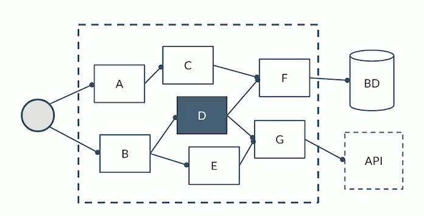
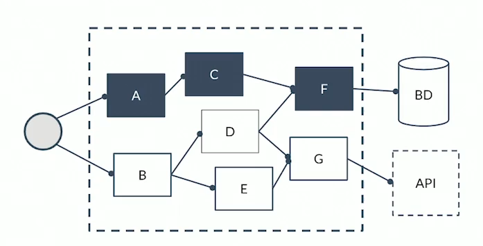
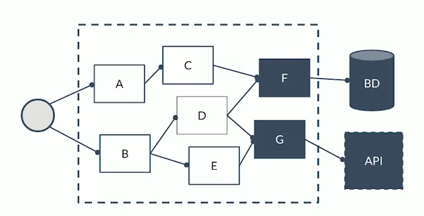
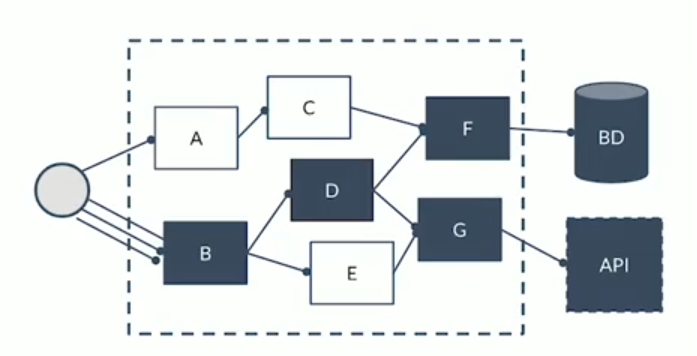
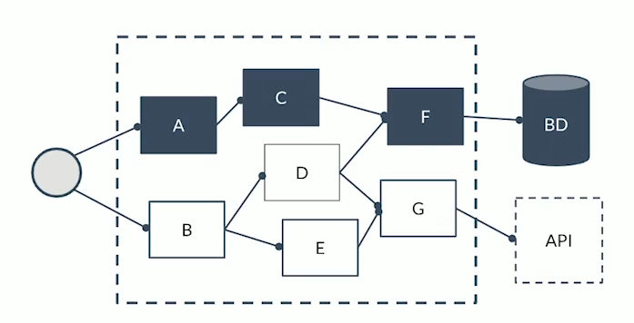
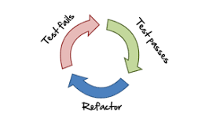

# JUnit Tests

# Indice

- [Definicion](#definicion)
- [Tipos de tests](#test-unitarios)
  - [Test unitarios](#test-unitarios)
  - [Test funcionales](#test-funcionales)
  - [Test de integracion](#test-de-integracion)
  - [Test de estres](#test-de-estres)
  - [Test end to end](#test-end-to-end)
- [Tests en Java](#tests-en-java)
- [TDD (Test Driven Development)](#tdd-test-driven-development)
  - [Reglas del TDD)](#reglas-del-tdd)

## Definicion:
Los tests en el desarrollo de software son porciones de codigo que
prueban nuestro codigo. Existen varios tipos de tests:

### Test unitarios:
Son para probar un componente especifico de la aplicacion.
  

### Test funcionales:
Son para probar una funcionalidad completa de la aplicacion.

### Test de integracion:
Son para probar si la integracion de la
aplicacion con componentes externos funciona correctamente, por ejemplo,
integracion con APIs, Bases de datos, entre otros.

### Test de estres:
Son para probar el comportamiento de la aplicacion
cuando una gran cantidad de usuarios hacen uso de ella, por ejemplo
probar como se comporta un API cuando recibe muchas solicitudes.

### Test end to end:
Pruebas completas de un sistema, de inicio a fin.

## Tests en Java
En Java las liberias mas populares para desarrollar tests son JUnit y
Mockito.

- JUnit: Libreria que nos ofrece clases e interfaces que nos facilitan
el desarrollo de tests.
  
- Mockito: Libreria para simulacion de clases, por ejemplo, si nuestra
aplicacion utiliza una pasarela de pagos y queremos probar si funciona
correctamente, sin la necesidad de realizar pagos reales, esto lo hacemos
con ayuda de Mocckito para simular la pasarela de pagos y poder ejecutar
los tests.

## TDD (Test Driven Development)
Desarrollo guiado por tests. Se trata de una tecnica de desarrollo de
software en el que primero creamos los tests y luego creamos el codigo
de la aplicacion que hace que pasen estos tests. Esto con el fin de
garantizar que nuestra aplicacion realice lo que debe hacer.

El TDD se basa en el ciclo Red-Green-Refactor:

- Red: Se escribe una prueba que falle.
  
- Green: Se implementa el código necesario para que la prueba pase.
  
- Refactor: Se revisa el código para mejorar su calidad.

### Reglas del TDD:

- Solo escribiras codigo de test hasta que falle.
  
- Solo escribiras codigo de produccion si es para pasar un test que falla.
  
- No escribirás más código del necesario para hacer pasar el test.